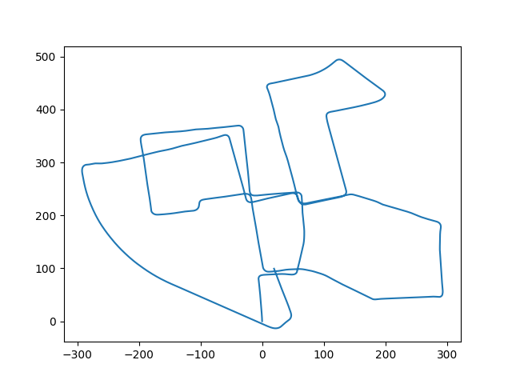
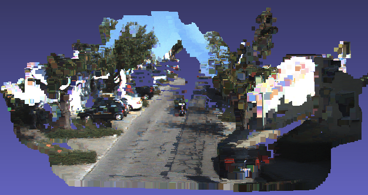

# VSLAM
Visual odometry, object tracking, scene reconstruction and occupancy grid maps using KITTI and Argoverse Datasets

##Trajectory followed by the vehicle generated from Visual odometry:

3D reconstruction of scenes using stereo images to be used for occupancy grid map generation:

